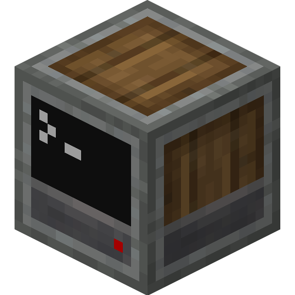

<p align=center></p>

<h1 align=center>ComputerCreate</h1>

ComputerCreate is a resource pack for minecraft that applies the texture style of the [Create Mod](https://modrinth.com/mod/create) to all recent flavors of ComputerCraft (CC:Tweaked for forge, CC:Retistched for fabric).

With this pack your computers will no longer looks out of place!

The pack changes the textures of each block, and improves the GUIs of computers and turtles.

You can find this pack on [Modrinth](https://modrinth.com/resourcepack/computercreate) and [CurseForge](https://www.curseforge.com/minecraft/texture-packs/computercreate).

## Previews

<details>
<summary> Overview </summary>
<br>


</details>

<details>
<sumary> Examples </summary>
<br>


</details>

<details>
<summary> GUIs </summary>


</details>

## I have an issue, contributing

Feel free to open an issue on the [GitHub](https://github.com/ascpial/ComputerCreate), if you have any question or issues.

I you want to contribute, you can open a pull request and I will take a look at it.

## Plans

The pack is globally finished, with all blocks and items textures.

## Working with the pack

To work on developping the pack, you can clone the repository directly in the resourcepacks folder of a minecraft instance.

If you work with multiple minecraft versions to make sure everything works and don't want to manually copy the resourcepack, a script is provided.
This script also removes all unnecessary files such as documentation, screenshot and source files (GIMP files).

You can run the script in a command line in this repository by running: `python distribute.py`.

By default, the script will create a zip file `ComputerCreate.zip` in the folder `output`. You can also customize the behaviour of the script by creating a `config.json` file:

```json
{
    "folder": ".",
    "destination": "./output/ComputerCreate.zip",
    "file_outputs": [
        "~/.minecraft/resourcepacks/ComputerCreate.zip",
        "~/prismlauncher/instances/Computers/.minecraft/resourcepacks/ComputerCreate.zip"
    ]
}
```

- `folder` is the location of the git repo, defaulting to `.` (current repository)
- `destination` is the primary place where the resourcepack is compiled, defaulting to `./output/ComputerCreate.zip` (this cannot be empty) (the default location is ignored by git)
- `file_outputs` is a list of places where to copy the compiled resourcepack in which you can add all your ComputerCraft instances, defaulting to `[]` (an empty list)

## Reuse this resourcepack

I have chosen the licence (CC BY) so that you can freely reuse the pack and modify it, but a mention to the original work is needed.

<br> <a rel="license" href="http://creativecommons.org/licenses/by/4.0/"></a><br />This work is licensed under a <a rel="license" href="http://creativecommons.org/licenses/by/4.0/">Creative Commons Attribution 4.0 International License</a>.
